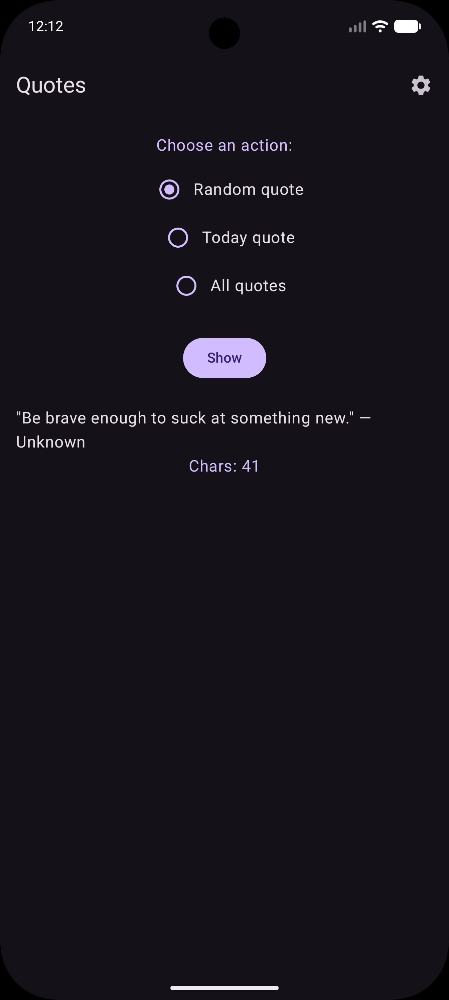
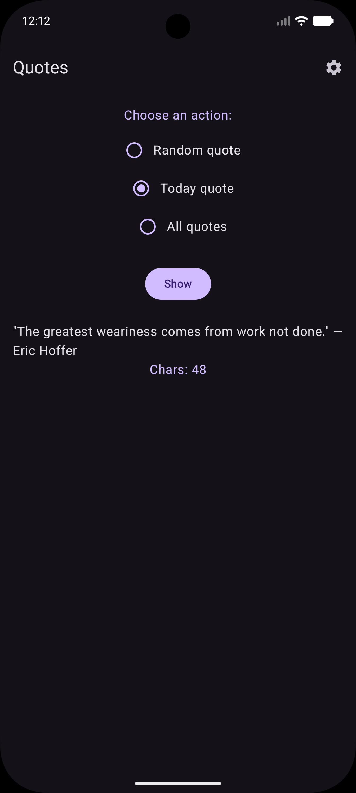
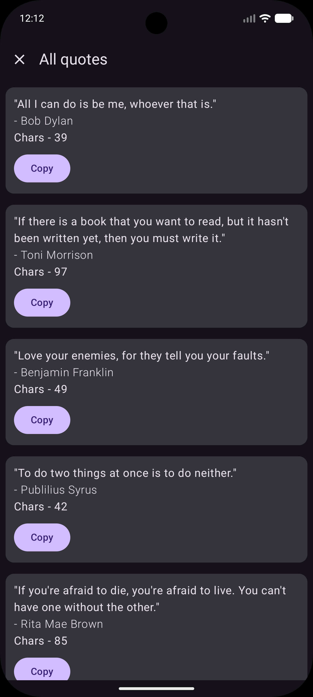
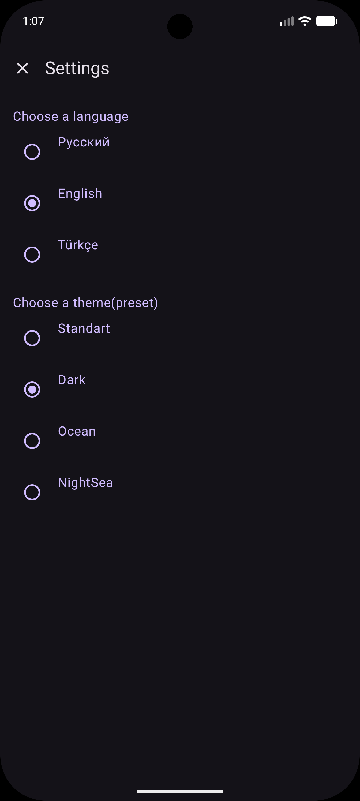
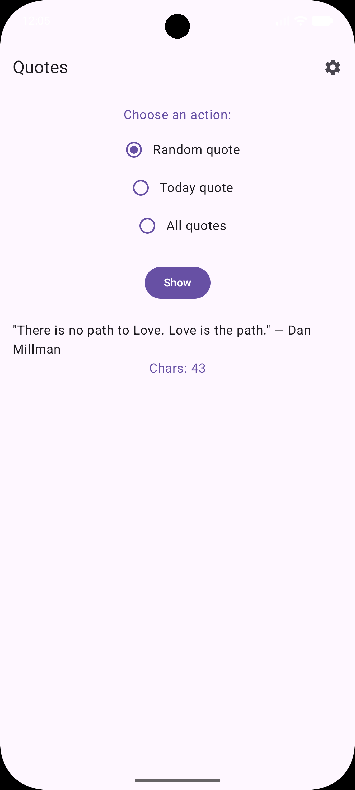
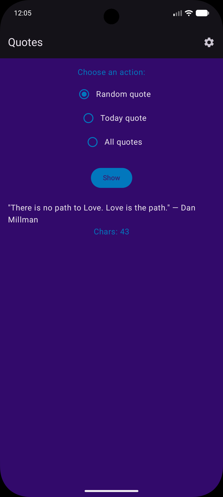
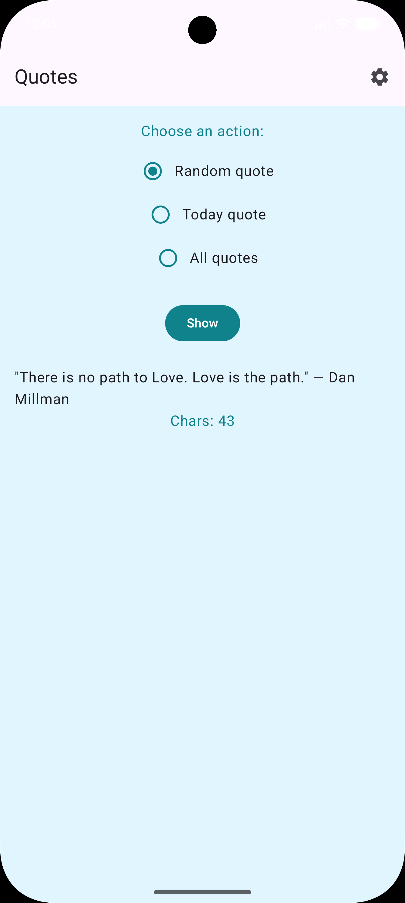

# InspireMe – Quotes App
A modern Android application for reading motivational quotes from the **ZenQuotes API**.  
Built with **Kotlin**, **Jetpack Compose**, **Retrofit**, and **MVVM** architecture.

The app supports two interface languages (**English / Russian**) and four visual themes.

---

## 📸 Screenshots

| Random quote | Quote of the Day |
|-------------|------------------|
|  |  |

| All Quotes List | Settings |
|--------------|-----------------|
|  |  |

| Light Theme | Dark Theme |
|-------------|------------|
|  |  |

| Night Sea Theme | OceanC Color Theme |
|-------------|------------|
|  |  |


---

## 🚀 Features

### 🌅 Quote of the Day  
Fetches daily motivation using ZenQuotes API endpoint `/today`.

### 🎲 Random Quote  
Returns a random inspirational quote from the API.

### 📚 Full Quotes List  
Loads the complete list of quotes and displays them in a scrollable list.

- each quote has a **Copy** button  

### 🌍 Multi-language Support  
The entire interface supports **English** and **Russian**.  
Switching language immediately updates the UI.

### 🎨 Theme Presets  
Choose from four color schemes:

- Light  
- Dark  
- Ocean  
- NightSea  

### 🧱 Architecture  
Project uses clean and maintainable MVVM architecture:

- **ViewModel** – handles logic and exposes UI state with StateFlow  
- **Repository** – interacts with ZenQuotes API  
- **Retrofit** – network client  
- **Compose UI** – declarative and modern UI

---

## 🛠️ Tech Stack

- **Kotlin**
- **Jetpack Compose**
- **Material 3**
- **Retrofit + Gson**
- **ViewModel + StateFlow**
- **Navigation Compose**
- **Coroutines**
- **MVVM**

---

## 🔗 API Reference (ZenQuotes)
Used endpoints:

- `https://zenquotes.io/api/today`
- `https://zenquotes.io/api/random`
- `https://zenquotes.io/api/quotes`

---

## 📦 Installation

Clone the repository:

```bash
git clone https://github.com/badvbes4ever-maker/quotes.git

